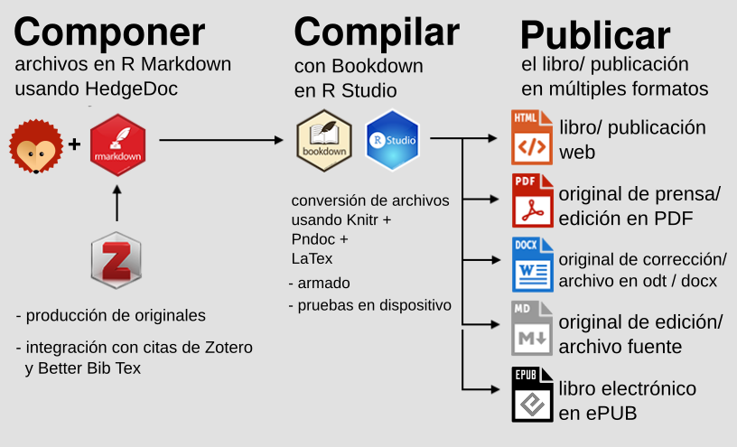
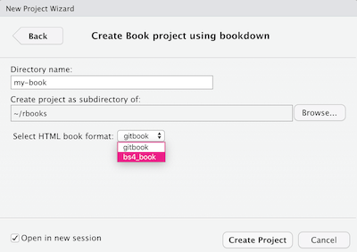

# &gt;


# Licencia de Producción de Pares (versión legible por humanes)

> Esto es un resumen legible por humanos del [texto legal (la licencia
> completa)](http://endefensadelsl.org/ppl_es.html) \#\# Ud. es libre de
> {-}

-   Compartir - copiar, distribuir, ejecutar y comunicar públicamente la
    obra
-   Hacer obras derivadas

## Bajo las condiciones siguientes:


## Entendiendo que

-   **Renuncia** - Alguna de estas condiciones puede no aplicarse si se
    obtiene el permiso del titular de los derechos de autor.

-   **Dominio Público** - Cuando la obra o alguno de sus elementos se
    halle en el dominio público según la ley vigente aplicable, esta
    situación no quedará afectada por la licencia.

-   **Otros derechos** - Los derechos siguientes no quedan afectados por
    la licencia de ninguna manera:

    -   Los derechos derivados de usos legítimos u otras limitaciones
        reconocidas por ley no se ven afectados por lo anterior;

    -   Los derechos morales del autor;

    -   Derechos que pueden ostentar otras personas sobre la propia obra
        o su uso, como por ejemplo derechos de imagen o de privacidad.

-   **Aviso** - Al reutilizar o distribuir la obra, tiene que dejar muy
    en cla los términos de la licencia de esta obra. La mejor forma de
    hacerlo es enlazar a esta página.

<!--chapter:end:index.Rmd-->

# 1 Introducción: *Bookdown* como herramienta de publicación ramificada

El flujo de trabajo que se propone a continuación, así como la
composición, imposición y archivos digitales de este TPF, fueron
realizados con herramientas de código abierto y de uso gratuito[1];
principalmente *Bookdown*, *GitHub* y *Zotero*. El objetivo de este
trabajo es explicar y documentar el desarrollo de un proyecto editorial
que combina dichas herramientas en un flujo de trabajo basado en
software libre y de acceso abierto, y que se orienta hacia un esquema de
edición digital ramificada, descentralizada y distribuida.

Así, los métodos propuestos en este trabajo se organizan en un flujo
editorial ramificado ([Santa Ana Anguiano,
2018](#ref-ramiroEdicionDigitalComo2018)) que consta de tres grandes
etapas: componer, compilar y publicar (ver Figura
<a href="#fig:workflow">1.1</a> ). A grandes rasgos y a los efectos de
este desarrollo, componer se refiere a producir los archivos fuente y
darles formato en R [Markdown](https://es.wikipedia.org/wiki/Markdown),
la versión del lenguaje de marcado *Markdown* optimizada para el
lenguaje de programación *R*; compilar consiste en correr un conjunto de
comandos, funciones y fragmento de código de *R* para imponer y generar
los archivos de salida; mientras que publicar consiste en la disposición
pública de la publicación en alguna plataforma y/o soporte.

Es decir que, la técnica productiva y reproductiva ([Seminario
Publicaciones Digitales,
2021a](#ref-seminariopublicacionesdigitalesUnidadParte2021)) que se
presenta en este desarrollo se organiza mediante un flujo de trabajo,
cuya característica es combinar una serie de scripts, algoritmos y
metadatos, de forma que un mismo contenido se adapte a distintos tipos
de publicaciones, productos digitales e incluso, publicaciones impresas.
Una consecuencia de esta característica es que en un solo paso se
generan múltiples archivos y publicaciones digitales para distintos
propósitos, dispositivos y plataformas:

-   Archivo del código fuente de la publicación en formato de extensión
    .md (*Markdown*) completo con rutas de acceso a imágenes estáticas
    para una fácil conversión a la plataforma del editor.
-   Edición web HMTL para el libro de acceso abierto, con *iframes*
    integrados a gráficos, videos, *gifs* y mapas interactivos.
-   Edición impuesta para imprenta (original de pre-prensa), lectura
    digital en formato PDF enriquecido.
-   Edición en formato EPUB de acceso abierto, con *iframes* integrados
    a gráficos, videos, *gifs* y mapas interactivos.
-   Edición en formatos de extensión .doc (Microsoft Word) y .odt
    (Libreoffice) para obras derivadas, revisiones y comentarios.

Entonces, a diferencia de lo que ocurre en un flujo de trabajo editorial
de tipo lineal, que requiere de la creación de archivos y códigos
distintos para diferentes tipos de ediciones y publicaciones; en el
esquema del flujo de trabajo ramificado, la producción de los
originales, el seguimiento del proceso editorial, la revisión, la
corrección, las colaboraciones y el control de cambios, ocurren todos
sobre un mismo archivo y de forma paralela.

Todo esto a su vez se relaciona con determinados modos de editar
(colaborativos y descentralizados), formas de poner el contenido en los
soportes (líquida, abierta y distribuida), y las estrategias comerciales
y de promoción de ventas.


<p class="caption">
Figura 1.1: Esquema simplificado de las etapas generales del flujo de
trabajo, componer, compilar y publicar en múltiples formatos
</p>

## 1.1 Sobre *Bookdown*, extensiones y software complementario

El flujo de trabajo está desarrollado en
[Bookdown](https://bookdown.org), un paquete de código abierto para el
lenguaje de programación [R](https://www.r-project.org/), creado por
Yihui Xie para la aplicación de escritorio gratuita
[RStudio](https://rstudio.com/). Aunque mucha gente usa *R* para
análisis estadístico, *RStudio* también es compatible con varias
soluciones de publicación ramificada. Así, los pasos que forman parte de
las tres grandes etapas (componer, compilar y publicar) de este flujo de
trabajo estan determinadas por *Bookdown*:

1.  Durante la etapa de composición:

-   Configuración de los archivos de *Bookdown* de forma que cada
    capítulo/ sección conste de un archivo de *R Markdown* (extensión
    .Rmd).

-   Organización de las citas, fuentes y referencias utilizando el
    gestor bibliográfico [Zotero](https://zotero.org/) desarrollado por
    el [Centro Roy Rosenzweig de Historia y Nuevos Medios de la
    Universidad George Mason](https://rrchnm.org/). Además, hay que
    instalar la extensión [Better
    BibTeX](https://github.com/retorquere/zotero-better-bibtex) para
    crear claves de citas en *Zotero* compatibles con *Bookdown*.

1.  Durante la etapa de compilación:

-   Creación de los archivos de salida utilizando el conversor universal
    de documentos [PanDoc](https://pandoc.org/) y el software de
    preparación de documentos [LaTeX](https://www.latex-project.org/).

-   Configuración de los datos de identificación en fuente y la capa de
    [licenciamiento](#licencias) libre (*copyleft*) o abierto (*Creative
    Commons*) en el archivo `index.Rmd` mediante una plantilla
    específica que se compila con el original.

-   Definición diferencial de contenido en función del formato de salida
    usando fragmentos de código de *R*. Esto se puede hacer incluso
    durante el proceso de escritura para hacer publicaciones parciales,
    generar capítulos promocionales, desarrollar la audiencia y hasta
    abrir la posibilidad de incorporar comentarios de lectorxs y
    colaboradores. Con las revisiones de cada jornada de trabajo se
    puede recompilar el libro, publicar las ediciones en el repositorio
    público de *GitHub* y usar el [generador de sitios estáticos
    integrado](https://pages.github.com/) para alojar el formato web
    HTML de la publicación (libro/ publicación web).

1.  Durante la etapa de publicación:

-   Subida de los archivos fuente a un repositorio de
    [*GitHub*](https://github.com/) (repo), que además de hacer posible
    la disposición pública de la publicación en internet mediante un
    sitio web; permite al equipo editorial, conocer las versiones del
    texto que se generan (traducción, corrección, revisión,
    ramificación, reedición, erc), planificar el proyecto, seguir el
    desarrollo del proceso editorial y a los autores, trabajar
    simultáneamente en el libro/ publicación en un repositorio
    común^\[Para acceder al repositorio de *GitHub* de este trabajo a
    modo de ejemplo, visitar: <https://github.com/etalii/tepepub>).

-   Implementar el modelo de [infraestructura como
    código](https://docs.microsoft.com/es-es/devops/deliver/what-is-infrastructure-as-code)
    para alojar el libro/ publicación web gratuitamente mediante *GitHub
    pages* (hosting). De esta forma, el sitio web que se genera, no
    solamente funciona como un producto editorial en sí, sino que además
    puede funcionar como interfaz de acceso al resto de las versiones de
    la publicación o ediciones (pdf, epub, mobi ,docx y md).

Sin embargo, la descripción del flujo de trabajo desarrollado en
*Bookdown* que se hace aquí, no es exhaustiva y comprende solo un
conjunto de elementos de análisis pertinentes a los contenidos del
Seminario de Publicaciones Digitales. Para obtener más detalles técnicos
sobre *Bookdown* y ejemplos de otras publicaciones creadas con esta
herramienta, se puede consultar <https://bookdown.org>.[2]

## 1.2 Cómo instalar y configurar *Bookdown*

A continuación, se enumeran los pasos que hay que seguir para configurar
la plataforma de publicación (*Bookdown*) y las herramientas
relacionadas necesarias para compilar este trabajo, utilizando *Ubuntu
20.04*. Esto no requiere conocimientos especiales sobre *Linux*, de
forma que los pasos para la instalación y la configuración en *Ubuntu*,
si bien son diferentes, son similares a los que se deben seguir para
*Windows* y *MacOs*.

1.  Instalar el lenguaje de programación *R*, requerido para usar
    *Bookdown*.

2.  Instalar la versión gratuita de *RStudio Desktop* para facilitar el
    uso de *R* mediante la interfaz gráfica del editor de texto. Algunes
    autores componen sus textos directo en *RStudio*, pero es
    recomendable usar algún editor de texto (como
    [HedgeDoc](https://docutopia.tupale.co/) ), ya que estos suelen
    tener comandos, atajos y opciones específicas que hacen más ágil la
    escritura.

3.  Dentro de *RStudio*, dirigirse a la pestaña “ *Packages* ” y
    seleccionar “ *Install* ” ( [ver captura de
    pantalla](images/packages-install.png) ).

4.  Dentro de *RStudio*, instalar el paquete " *bookdown* " y
    seleccionar “ *Install Dependencies* ” ( [ver captura de
    pantalla](images/bookdown-install.png) ).

5.  Para que *Bookdown* cree la versión de la publicación en PDF hay que
    instalar un motor de [LaTeX](https://en.wikipedia.org/wiki/LaTeX)
    que transforme los formatos de las citas e imágenes de *Markdown* a
    estilos de página preconfigurados. Dado que *LaTeX* es muy pesado,
    la documentación de *Bookdown* recomienda el paquete *TinyTeX* que
    es más ligero. Para instalarlo, dentro de *RStudio* hay que
    seleccionar la pestaña “ *Packages* ”, seleccionar “ *Install* ” y
    tipear " *tinytex* " para buscar y cargar el paquete ( [ver captura
    de pantalla](images/tinytex-install.png) ).

6.  Para terminar de instalar " *tinytex* " hay que escribir
    `tinytex :: install_tinytex ()` en la consola de RStudio y presionar
    “ *return* ”. ( [ver captura de pantalla](images/tinytex-finish.png)
    )

7.  Junto con la instalación de *RStudio*, hay que instalar *Pandoc*, el
    paquete que convierte archivos del formato *Markdown* a HMTL y otros
    formatos. Para confirmar la instalación de *Pandoc* y el número de
    versión hay que escribir `rmarkdown :: pandoc_version ()` en la
    consola de *RStudio*, y presionar “ *return* ”. El número de la
    versión instalada debe ser 2.3.1 o superior. Para instalar una
    versión más reciente de *Pandoc*, que es muy recomendable, dirigirse
    a <https://pandoc.org>.

<!--chapter:end:01-intro.Rmd-->

# 2 Componer

## 2.1 Estructura de archivos y encabezados

En general, cada capítulo es un archivo .Rmd independiente. Esto implica
que, en caso de editar el contenido de la publicación en simultáneo, les
coautorxs tienen que trabajar en diferentes capítulos del libro y enviar
regularmente *commits* al repositorio. Una alternativa para evitar
conflictos en el repositorio, es trasladar el proceso de escritura a un
editor de texto externo especializado en *Markdown* que tenga control de
versiones, que sea colaborativo y multiplataforma, como *HedgeDoc*. Del
mismo modo, es recomendable que solamente une miembrx del equipo compile
regularmente el libro con *Bookdown* para evitar conflictos de
combinación de código.

A continuación se propone un esquema simplificado de la estructura del
archivo raíz del proyecto (y disponible en el repositorio de *GitHub*):

-   Prefacio de la publicación con secciones no numeradas: `index.Rmd`

-   Capítulos con encabezados de primer nivel en este formato:
    `01-capitulo.Rmd`

-   Secciones dentro de los capítulos con encabezados de segundo nivel
    en este formato: `01.1-subcapítulo.Rmd`.

-   La carpeta de imágenes, donde se encuentran las imágenes PNG, JPG y
    PDF que se van a renderizar y mostrar en los capítulos.

-   La carpeta *docs*, que contiene los archivos fuente de la
    publicación, como la edición Web (`index.html`, `Introduccion.html`,
    etc.), la salida PDF, etc.

-   Archivos auxiliares adicionales que se describen más adelante.

Una forma que ofrece *Bookdown* para manejar las referencias cruzadas es
la asignación de un ID predeterminado a cada encabezado. Por ejemplo, el
ID predeterminado para `# Tema` es `{#tema}`, y el ID predeterminado
para `## Nombre de sección` es `{# nombre-de-sección}`, donde los
espacios se reemplazan por guiones.

Como los IDs predeterminados pueden cambiar debido a la edición o estar
duplicados en la publicación, en su lugar se puede asignar manualmente
un ID único a cada encabezado de primer y segundo nivel de la siguiente
manera:

    # Título de capítulo de primer nivel de jerarquía {#nombre-único}
    ## Título de sección de segundo nivel de jerarquía {- #nombre-único}
    ### Título de sección de tercer nivel de jerarquía {-}
    #### Título de sección de cuarto nivel de jerarquía {-}

De forma que es importante tener en cuenta que el símbolo {-}, usado
solo o en combinación con un espacio y una identificación única, evita
la numeración automática en los encabezados de segundo a cuarto nivel.

Además, es posible hacer coincidir la palabra clave ID única con el
nombre del archivo para los capítulos de nivel superior de esta manera:
`01-palabra-clave.Rmd` para mayor organización. Los nombres únicos deben
contener solamente caracteres alfanuméricos (a-z, A-Z, 0-9) o guiones
(-). A su vez, los subtítulos deben tener nombres o IDs únicos para
evitar errores de *Bookdown* sobre referencias duplicadas. Para evitar
este problema con los subtítulos repetidos (como podría darse en el uso
de una sección “Resumen”), al final de cada capítulo se puede insertar
un subtítulo de resumen de tercer nivel, pero para eso hay que usar un
ID único que coincida con el número de cada capítulo, como este:
`### Resumen {- # resumen17}`. Del mismo modo, un encabezado especial
podría constituir por ejemplo, un apéndice e indicarse con `(APÉNDICE)`.
indicando que todos los capítulos que aparecen después son apéndices.
Según la documentación de *Bookdown*, el estilo de numeración aparecerá
correctamente en la salida HTML y LaTeX / PDF, pero no en .doc y otros
formatos de libros / publicaciones electrónicos.

    # Capítulo Uno

    # Capítulo Dos

    # (APÉNDICE) Apéndice {-}

    # Apéndice A

    # Apéndice B

Por otro lado, en el archivo `index.Rmd` del directorio de trabajo del
proyecto se configuran las opciones para la salida del libro/
publicación HTML y la salida PDF. La configuración `toc_depth: 2`
muestra los encabezados de los capítulos y secciones hasta el segundo
nivel en la Tabla de contenido.

La configuración de la opción `split_by:` divide las páginas HTML en el
encabezado del segundo nivel, lo que crea páginas web más cortas con un
desplazamiento reducido para les lectorxs. Para cada página web, el ID
único se convierte en el nombre del archivo y se almacena en la
subcarpeta *docs*.

La configuración de `number_sections` tiene que tener valor *true*
(verdadero) para las ediciones HTML y PDF, y el valor toc\_depth en 2,
esto significa que se va a mostrar la numeración de sección de capítulo
de dos niveles (1.1, 1.2, etc.) en la tabla de contenidos. Hay que tener
en cuenta que `number_sections` debe ser verdadero para mostrar los
números de figura y tabla en formato x.x. La configuración relevante se
puede consultar en este extracto del archivo `index.Rmd`:

    output:
      bookdown::gitbook:
        ...
        toc_depth: 2
        split_by: section
        number_sections: true
        split_bib: false
        ...
    bookdown::pdf_book:
      toc_depth: 2
      number_sections: true

Es importante tener en cuenta que en la configuración de
`_bookdown.yml`, todas las salidas estan integradas en la subcarpeta
*docs* del repositorio de *GitHub*, como se muestra en este extracto:

    output_dir: "docs"
    delete_merged_file: true
    book_filename: "Título"
    language:
      label:
        fig: "Figura "
        tab: "Tabla "
    chapter_name: "Capitulo "

Si en el repositorio de *GitHub* se llevaron a cabo las configuraciones
tales que el sitio se publique en la web mediante `main / docs`,
significa que lxs lectores pueden explorar los archivos de origen en el
nivel raíz y ver las páginas web HTML alojadas en la subcarpeta de
documentos. La subcarpeta de documentos también puede contener los
siguientes elementos, que no son generados por *Bookdown* y deben
crearse manualmente:

-   Archivo `CNAME` para el dominio personalizado, generado por *GitHub
    Pages*.

-   Archivo `.nojekyll` vacío y oculto para garantizar un procesamiento
    rápido de archivos HTML por *GitHub Pages*.

-   Archivo `404.html` personalizado para redirigir cualquier dirección
    web errónea bajo el dominio a la página `index.html`.

Una opción más es copiar el código de *Google Analytics* para el libro
web, pegarlo en un archivo HTML en el repositorio del proyecto e incluir
esta referencia en el código `index.Rmd`:

    output:
      bookdown::gitbook:
      ...
      includes:
        in_header: google-analytics.html

## 2.2 Hoja de estilo

Sobre la base de lo que establecen las reglas de formato y estilo
propias de *Markdown*, es posible aplicar una serie de criterios
técnicos y estilísticos para editar y escribir de manera consistente
usando *Bookdown*. La guía de estilo de
[O’Reilly](https://oreillymedia.github.io/production-resources/styleguide/)
propone una serie de pautas específicas para formatos electrónicos, que
abarcan entre otros temas, la estructura de capitulos, las transiciones
y el uso de enlaces externos e incrustados, ya sea en línea corrida o en
bloque.

Por otro lado, cada capítulo o sección de una publicación de *Bookdown*
está maquetado por un archivo *Markdown* de *R* (.Rmd) separado;
mientras que en cada archivo `.Rmd`, cada párrafo comienza en una línea
aparte. A modo de ejemplo, acá se puede ver el [código fuente de esta
página](https://github.com/etalii/tepepub/02-componer.Rmd).

## 2.3 *Zotero* y *Better BibTeX* para las notas y la bibliografía

Este flujo de trabajo basado en *Bookdown* permite utilizar el gestor
bibliográfico de código abierto *Zotero*, en conjunto con la extensión
[Better BibTeX](https://retorque.re/zotero-better-bibtex/), para
simplificar el proceso de citar fuentes y crear bibliografías. Así, en
lugar de escribir las referencias completas directamente en el texto, se
puede insertar una breve clave de cita en el original de la publicación
y las herramientas generarán automáticamente las referencias deseadas en
el formato de preferencia, creando al final de la publicación, una
bibliografía alfabética de todas las fuentes citadas.

Para crear una cita, una vez instaladas las herramientas, se debe seguir
la siguiente secuencia de pasos:

1.  Crear una entrada para cada fuente (libro, artículo de revista,
    documento, etc.) en la biblioteca de *Zotero*.

2.  Seleccionar y cargar el estilo de cita preferido en formato `.csl`,
    cor ejemplo `apa.csl`.

3.  Para cada fuente, *Better BibTeX* genera una clave de cita única
    similar a esta `manovichLenguajeNuevosMedios2006`, que se puede
    pegar con formato para crear una nota en el original de la
    publicación.

Por último, hay que tener en cuenta que cada vez que se crea un libro
dentro de *Bookdown* hace falta exportar la biblioteca o colección de
*Zotero* en formato .bib al repositorio de *Bookdown*. Esto genera el
archivo que contiene los datos de referencia para que coincidan con las
claves de cita en el texto.

### 2.3.1 Demostración de cita

Para generar una cita se debe ingresar la clave de cita en el siguiente
formato y a continuación del fragmento que se desea referenciar,
`[@manovichLenguajeNuevosMedios2006]`. Esto se va a visualizar de esta
manera en los formatos de salida: ([Manovich,
2006](#ref-manovichLenguajeNuevosMedios2006)).

### 2.3.2 Manejo de referencias cruzadas

Para hacer una referencia cruzada en *Bookdown* hay que asignar un
nombre único o una etiqueta de fragmento de código de *R* a cada
capítulo/ sección, figura y tabla. Los nombres y etiquetas únicos deben
contener solo caracteres alfanuméricos (a-z, A-Z, 0-9) o guiones (-).

A diferencia de lo que plantea el [manual de
*Bookdown*](https://bookdown.org/yihui/bookdown/cross-references.html),
es conveniente evitar el uso de enlaces de ID únicos para hacer
referencias cruzadas de capítulos o secciones, ya que estos crean URLs
imprecisas y hashtags extraños para secciones subordinadas.

Para hacer una referencia cruzada a cualquier capítulo o sección, es
preferible usar un enlace HTML de nombre único, como `index.html` o
`style-guide.html` .

Para hacer referencias cruzadas de figuras y tablas, mostrar su
numeración automática y permitir que les lectorxs salten allí, hay que
escribir una llamada con una referencia de *Bookdown* a una etiqueta de
fragmento de código, como
`Ver Figura <a href="#fig:nombre-de-la-imagen"><strong>??</strong></a>`
o `Ver Tabla <a href="#tab:nombre-de-la-tabla"><strong>??</strong></a>`.

Además, la interactividad de las referencias cruzadas varía según la
salida de la siguiente forma:

-   En HTML, se puede hacer clic en todas las referencias cruzadas.

-   En PDF, se puede hacer clic en todas las referencias cruzadas,
    excepto los enlaces HTML a nivel de capítulo.

-   En doc y odt, no se puede hacer clic en referencias cruzadas.

## 2.4 Imágenes y formato de los fragmentos de código

En general, es recomendable usar imágenes en formato PNG (preferido ante
JPG debido a cuestiones de calidad del formato). Por otro lado, los
archivos de imagen se deben guardar en la subcarpeta de imágenes que
corresponde a cada capítulo. En caso de que uno de los archivos de
salida sea el original de prensa para generar copias físicas impresas,
hay que asegurarse de que las imágenes en color estén en alto contraste
y/o sombreado, ya que le impresore las convertirá a escala de grises
para la publicación / el libro impresa/o. Además, los nombres de los
archivos se tienen que escribir en minúsculas con guiones (no espacios)
y comenzar con la palabra clave de la sección correspondiente, para que
las imágenes relacionadas se mantengan agrupadas. Incluso si estan en
subcarpetas separadas, hay que evitar nombres de archivo de imagen
duplicados para toda la publicación. También hay que evitar numerar las
imágenes, ya que es posible que no coincidan con la secuencia final.

Dado que las imágenes PNG grandes a veces parecen demasiado grandes en
la edición PDF, es recomendable convertir una copia en una imagen PDF
más pequeña para que se ajuste mejor. Para esto se pueden procesar las
imágenes en lotes, ya sea desde la terminal - usando el comando
`convert` de bash-, o desde la interfaz gráfica del sistema operativo
que se esté utilizando. Como resultado, una imagen simple puede tener
solo un archivo en la carpeta de imágenes, pero las imágenes grandes y
complejas pueden constar de varios archivos.

Usando la sintaxis de *R Markdown*, *Bookdown* hace posible crear
diferentes versiones de imágenes para diferentes ediciones. Así, para
cada imagen se puede requerir un conjunto distinto de instrucciones para
mostrar un gráfico/ mapa/ video interactivo usando, por ejemplo, un
*iframe* incrustado en la edición web HTML, pero mostrar una imagen PNG
estática en la edición completa de *Markdown*, o sustituir un PDF
estático más pequeño cuando esté disponible en la edición del libro PDF.

Esta solución se basa en el formato de fragmentos de código de *R* para
la mayoría de las imágenes, con algunas excepciones. Esta sintaxis *R
Markdown* / *Bookdown* es más compleja que el formato de imagen
*Markdown* básico, pero admite el formato condicional y los subtítulos
en todas las ediciones, así como la numeración automática en las
ediciones HMTL y *LaTeX*/ PDF. El formato general de imagen de los
fragmentos de código de *R* se ve más o menos así:

    ...como se muestra en la Figura \@ref(fig: palabra-clave/ nombre de la imagen sin extensión).

    (ref: palabra-clave/ nombre de la imagen sin extensión) Leyenda con enlaces en formato _Markdown_, pero sin la posibilidad de establecer notas al pie.

    {r palabra-clave, fig.cap="(ref:palabra-clave)"}
    if(knitr::is_html_output(excludes="markdown")) knitr::include_url("https://nombre-de-ruta-a-la-version-interactiva-palabra-clave-o-nombre-de-la-imagen-sin-extensión.html")
    else knitr::include_graphics("nombre-de-ruta-a-la-version-estatica-nombre-de-la-imagen.png")

Donde la primera línea genera una llamada de referencia cruzada de
figura numerada automáticamente y en la que se puede hacer *click*.
Notar además que la numeración automática aparece en formato de *figura
x.x* en HTML, PDF, odt y doc, pero en formato *figura x* en *Markdown*.
Esta llamada es importante porque las imágenes en la salida PDF
“flotarán” por diseño y pueden aparecer antes o después de la página
deseada.

La segunda línea contiene el título con enlaces opcionales en formato
*Markdown*. Pero no se debe insertar notas al pie con claves de citas de
*Zotero*, ya que van a generar errores en la salida PDF. Las notas al
pie detalladas sobre las fuentes de las imágenes, se deben insertar en
el cuerpo del texto y usar el título solo para una breve mención de
“Fuente:”

El tercer bloque es el fragmento de código de *R*. En la práctica, el
fragmento de código se separa de las otras dos líneas usando tres marcas
de verificación de código, omitidas aquí por simplicidad. La primera
parte hace referencia a la palabra clave en la llamada y también al
título anterior. La última parte puede simplemente indicarle a
*Bookdown* que incluya una imagen estática (cuando no hay una versión
interactiva), o puede incluir una declaración `if-else` para formato
condicional cuando existen versiones, tanto interactivas, como
estáticas.

La declaración *if* para la salida HTML contiene
`(excludes = "markdown")` porque *Markdown* se considera un formato
HTML, como se describe en el [*R Markdown
Cookbook*](https://bookdown.org/yihui/rmarkdown-cookbook/latex-html.html).
Dado que la plataforma del editor aceptará una versión *Markdown*
completa de la publicación, que muestra imágenes estáticas en lugar de
visualizaciones interactivas, debemos generar el archivo “markdown” de
manera diferente a la edición web HTML.

Las etiquetas de fragmentos de código de *R* tienen que tener la misma
palabra clave que el nombre del archivo de la imagen. Acá también hay
que evitar usar etiquetas duplicadas para toda la publicación y usar
solamente letras, números y guiones medios (no guiones bajos):

    ref:palabra-clave-con-guiones

    images/07-ejemplo/nombre-de-la-imagen-con-guiones.png

Hay que prestar especial cuidado de forma de no insertar espacios dentro
de la etiqueta `ref:palabra-clave-con-guiones` para el título. Pero sí
es deseable agregar una línea en blanco para separarlo del fragmento de
código. Después del fragmento de código, hay que agregar otra línea en
blanco para evitar errores de tipo “ *undefined reference* ”
(“referencia indefinida”).

No es recomendable usar caracteres como `<` o `>` o `"` dentro del
título de referencia del fragmento de código de *R*, ya que van a
arrojar errores de HTML en las imágenes de salida de *Markdown*. En su
lugar, se pueden usar caracteres como `*` y `-` para designar
instrucciones, como por ejemplo: “Archivo - Hacer una copia.”

Por último, en el archivo `index.Rmd` de todo proyecto de *Bookdown* es
posible llevar a cabo una serie de configuraciones globales de
fragmentos de código de *R*. Así, es recomendable que justo
inmediatamente después del primer encabezado ( `# Portada` en el caso de
la publicación de este trabajo) se configure que toda imagen del
proyecto que se inserte con fragmentos de código, lo haga sin “eco” .
Esto quiere decir que solo se muestre la imagen y no el código utilizado
para generar esa imagen. La otra configuración recomendable es la que
inserta automáticamente la versión PDF de una imagen PNG/JPG (siempre
que exista) en la salida PDF, lo que permite reducir manualmente el
tamaño de las imágenes grandes que se muestran en el libro/ publicación
PDF.[3]

### 2.4.1 Demostración: fragmento de código de *R* para imagen estática en todas las ediciones: HTML, PDF, ODT, DOCX y MD

…como se muestra en la Figura <a href="#fig:sample-image">2.1</a>.


<p class="caption">
Figura 2.1: Leyenda con enlaces en formato *Markdown*, pero sin la
posibilidad de establecer notas al pie
</p>


    ...como se muestra en la Figura \@ref(fig:sample-image).

    Leyenda con enlaces en formato _Markdown_, pero sin la posibilidad de establecer notas al pieLeyenda con enlaces en formato _Markdown_, pero sin la posibilidad de establecer notas al pie

      (```){r sample-image, fig.cap="Leyenda con enlaces en formato _Markdown_, pero sin la posibilidad de establecer notas al pie"}
        
      (```)

    * los paréntesis son ilustrativos y se tienen que eliminar para que el fragmento de código funcione

### 2.4.2 Demostración: fragmento de código de *R* para iframe en HTML e imagen estática en PDF, ODT, DOCX y MD

…como se muestra en la Figura <a href="#fig:sample-map">2.2</a>.


<p class="caption">
Figura 2.2: Explorar el mapa interactivo de
[OSM](https://www.openstreetmap.org/note/3023469). Les lectorxs de
ediciones que no sean HTML van a poder verlo de forma estática.
</p>

    ...como se muestra en la Figura \@ref(fig:sample-map).

    Explorar el mapa interactivo de [OSM](https://www.openstreetmap.org/note/3023469). Les lectorxs de ediciones que no sean HTML van a poder verlo de forma estática. Explorar el mapa interactivo de [OSM](https://www.openstreetmap.org/note/3023469). Les lectorxs de ediciones que no sean HTML van a poder verlo de forma estática.

    (```){r sample-map, fig.cap="Explorar el mapa interactivo de [OSM](https://www.openstreetmap.org/note/3023469). Les lectorxs de ediciones que no sean HTML van a poder verlo de forma estática."}
    if(knitr::is_html_output(excludes="markdown")) knitr::include_url("https://www.openstreetmap.org/note/3023469", height = "375px") else knitr::include_graphics("images/sample-map.png")
    (```)

### 2.4.3 Demostración: fragmento de código de *R* para GIF animado en HTML e imagen estática en PDF, ODT, DOCX y MD

…como se muestra en la Figura <a href="#fig:sample-gif">2.3</a>.


<p class="caption">
Figura 2.3: Ver un [GIF
animado](https://etalii.github.io/tepepub/images/sample.gif). Les
lectorxs de ediciones que no sean HTML van a poder verlo de forma
estática
</p>


    ...como se muestra en la Figura \@ref(fig:sample-gif).

    Ver un [GIF animado](https://etalii.github.io/tepepub/images/sample.gif). Les lectorxs de ediciones que no sean HTML van a poder verlo de forma estática Ver un [GIF animado](https://etalii.github.io/tepepub/images/sample.gif). Les lectorxs de ediciones que no sean HTML van a poder verlo de forma estática

    (```){r sample-gif, fig.cap="Ver un [GIF animado](https://etalii.github.io/tepepub/images/sample.gif). Les lectorxs de ediciones que no sean HTML van a poder verlo de forma estática"}
    if(knitr::is_html_output(excludes="markdown")) knitr::include_url("images/sample-gif.gif", height = "250px") else knitr::include_graphics("images/sample-gif.png")
    (```)

### 2.4.4 Demostración: fragmento de código de *R* para incrustar video en HTML e imagen estática en PDF, ODT, DOCX y MD

Para esto hay que asegurarse de usar el enlace de inserción de
*YouTube*, *Vimeo* o cualquiera sea la fuente del video en la web.

…como se muestra en el Video <a href="#fig:sample-video">2.4</a>


<p class="caption">
Figura 2.4: Ver un [video en
YouTube](https://www.youtube.com/watch?v=dVqVscgwSpw). Les lectorxs de
ediciones que no sean HTML van a poder verlo de forma estática
</p>

    ...como se muestra en el Video \@ref(fig:sample-video)

    Ver un [video en YouTube](https://www.youtube.com/watch?v=dVqVscgwSpw). Les lectorxs de ediciones que no sean HTML van a poder verlo de forma estática Ver un [video en YouTube](https://www.youtube.com/watch?v=dVqVscgwSpw). Les lectorxs de ediciones que no sean HTML van a poder verlo de forma estática

    (```){r sample-video, fig.cap="Ver un [video en YouTube](https://www.youtube.com/watch?v=dVqVscgwSpw). Les lectorxs de ediciones que no sean HTML van a poder verlo de forma estática"}
    if(knitr::is_html_output(excludes="markdown")) knitr::include_url("https://www.youtube.com/embed/dVqVscgwSpw") else knitr::include_graphics("images/sample-image2.png")
    (```)

### 2.4.5 Manejo de tablas en formato *Markdown*

La creación de tablas en formato Markdown se puede gestionar mediante
[*Tables Generator*](https://www.tablesgenerator.com/markdown_tables)
que además de producir buenos resultados para HTML, PDF, odt, doc y
*Markdown* permite importar datos de tablas en formato CSV.

El código de la tabla *Markdown* que se muestra a continuación se tiene
que agregar a la numeración automática (Tabla x) en HTML, PDF, odt y doc
(Ver Tabla <a href="#tab:left-table">2.1</a>).

<table>
<caption>Tabla 2.1: Contenido alineado a izquierda. Recordar dejar una fila en blanco entre los encabezados/ nombres de las columnas y el contenido</caption>
<colgroup>
<col style="width: 55%" />
<col style="width: 22%" />
<col style="width: 22%" />
</colgroup>
<thead>
<tr class="header">
<th style="text-align: left;">Un encabezado muy muy largo</th>
<th style="text-align: left;">Encabezado corto</th>
<th style="text-align: left;">Encabezadito</th>
</tr>
</thead>
<tbody>
<tr class="odd">
<td style="text-align: left;">Contenido alineado a la izquierda</td>
<td style="text-align: left;">número/ texto</td>
<td style="text-align: left;">número/ texto</td>
</tr>
<tr class="even">
<td style="text-align: left;">Se pueden usar guines para obtener columnas más grandes</td>
<td style="text-align: left;">número/ texto</td>
<td style="text-align: left;">número/ texto</td>
</tr>
</tbody>
</table>

Tabla 2.1: Contenido alineado a izquierda. Recordar dejar una fila en
blanco entre los encabezados/ nombres de las columnas y el contenido

Se compone así:


    ...(Ver Tabla \@ref(tab:left-table)).

    Table: (\#tab:left-table) Contenido alineado a izquierda. Recordar dejar una fila en blanco entre los encabezados/ nombres de las columnas y el contenido

    | Un encabezado muy muy largo | Encabezado corto | Encabezadito |
    |:---------|:---|:---|
    | Contenido alineado a la izquierda | número/ texto | número/ texto |
    | Se pueden usar guines para obtener columnas más grandes | número/ texto | número/ texto |

Si queremos que el contenido esté alineado a la derecha como se muestra
en la Tabla <a href="#tab:right-table">2.2</a>

Tabla: (\#tab:right-table) Contenido alineado a la derecha. Recordar
dejar una fila en blanco entre los encabezados/ nombres de las columnas
y el contenido

<table>
<colgroup>
<col style="width: 33%" />
<col style="width: 33%" />
<col style="width: 33%" />
</colgroup>
<thead>
<tr class="header">
<th style="text-align: right;">Encabezado1</th>
<th style="text-align: right;">Encabezado2</th>
<th style="text-align: right;">Encabezado3</th>
</tr>
</thead>
<tbody>
<tr class="odd">
<td style="text-align: right;">123</td>
<td style="text-align: right;">456</td>
<td style="text-align: right;">789</td>
</tr>
<tr class="even">
<td style="text-align: right;">Contenido alineado a la derecha</td>
<td style="text-align: right;">número/ texto</td>
<td style="text-align: right;">número/ texto</td>
</tr>
<tr class="odd">
<td style="text-align: right;">la misma cantidad de guiones</td>
<td style="text-align: right;">entre las columnas de la línea en blanco</td>
<td style="text-align: right;">garantiza mismo tamaño de columnas</td>
</tr>
</tbody>
</table>

Se debe componer así:


    ...como se muestra en la Tabla \@ref(tab:right-table)

    Tabla: (\#tab:right-table) Contenido alineado a la derecha. Recordar dejar una fila en blanco entre los encabezados/ nombres de las columnas y el contenido

    | Encabezado1 | Encabezado2 | Encabezado3 |
    |-----:|-----:|-----:|
    | 123 | 456 | 789 |
    | Contenido alineado a la derecha | contenido numérico | contenido numérico |
    | la misma cantidad de guiones | entre las columnas de la línea en blanco | garantiza mismo tamaño de columnas |

<!--chapter:end:02-componer.Rmd-->

# 3 Compilar

## 3.1 Distintos formatos en un solo paso

Para compilar el libro/ publicación en múltiples formatos (HTML,
*LaTeX*/ PDF, odt, doc y Epub) y en un solo paso, se puede llamar la
función `bookdown::render_book()` desde la línea de comandos de *R* o
hacer *click* en el botón `Build Book` del panel `Build` en *RStudio*.

Por otro lado, los formatos de salida se configuran en el archivo
`_output.yml` del proyecto. En el caso que, por ejemplo, se desee
compilar una publicación en los formatos libro de *git* (*gitbook*),
HTML, *LaTeX*/ PDF y Epub, dicho archivo YAML se debe configurar de la
siguiente forma:

    output:
      bookdown::gitbook:
        css: style.css
        repo: https://github.com/etalii/tepepub
        config:
          toc:
            before: |
              <li> </li>
            after: |
              <li> </li>
          download: ["pdf", "epub"]
      bookdown::pdf_book:
        includes:
          in_header: preamble.tex
        latex_engine: xelatex
        citation_package: natbib
        keep_tex: yes
      bookdown::html_book
      bookdown::epub_book: default

## 3.2 Uso del formato condicional

El formato condicional ofrece la opción de mostrar texto o imágenes en
algunas ediciones de la publicación, pero no en otras. A continuación,
se muestran varias formas de utilizar el formato condicional:

-   Insertar un comentario de código HTML `<! - comentario ->` en el
    archivo `.Rmd` para ocultar algunas líneas de texto. Esto aparece
    como texto comentado en los formatos HTML y .md, por ende, no se
    muestra en el navegador HTML y no aparece de ninguna manera en los
    formatos PDF o .doc .

-   Adecuar la salida condicional a diferentes publicaciones mediante la
    función del paquete de *R* `is_ [html / latex] _output` que permite,
    por ejemplo, que el texto sea visible en la edición HTML, pero no en
    la edición PDF o viceversa.

-   Personalizar el código de las hojas de estilo en *CSS* ( `style.css`
    ) de la publicación web.

-   Agregar encabezados, pies de página y bajadas al texto en las
    versiones HTML o *LaTeX*.

-   Compilar diferentes versiones de la publicación en HTML y *LaTeX* /
    PDF que se compongan de los mismos capítulos/ secciones en distinto
    órden, mediante la enumeración diferencial en el
    archivo`_bookdown.yml`. De esta manera es posible publicar todos los
    capítulos / secciones para la versión HTML, mientras que solamente
    se compilen los capítulos seleccionados en el PDF:

<!-- -->

    # cuando se compilan todos los capítulos para un libro/ publicación HTML hay que comentarlos todos, mientras que se tiene que  eliminar el comentario para omitir los capítulos que no se enumeran a continuación de las versiones PDF y _Markdown_ para ORM


    # rmd_files: [
    #   "index.Rmd",
    #   "0.0-introduction.Rmd",
    #   "01-choose.Rmd",
    #   "02-spreadsheet.Rmd",
    #   "03-find.Rmd",
    #   "04-clean.Rmd",
    #   "05-comparisons.Rmd",
    #   "06-chart.Rmd",
    #   "07-map.Rmd",
    #   "08-table.Rmd",
    #   "09-embed.Rmd",
    #   "10-github.Rmd",
    #   "11-chartcode.Rmd",
    #   "12-leaflet.Rmd",
    #   "13-transform.Rmd",
    #   "14-detect.Rmd",
    #   "15-story.Rmd",
    #   "16-fix.Rmd",
    #   "21-references.Rmd"
    # ]

<!--chapter:end:03-compilar.Rmd-->

# 4 Publicar

## 4.1 *Github* y el código como infraestructura

Si bien *Bookdown* no requiere el uso de *GitHub*, este flujo de trabajo
integra *Bookdown* y *GitHub* mediante la función `bookdown::gitbook` y
el archivo de salida `gitbook` para generar una publicación o libro web.
Para ello hace falta:

1.  Crear una cuenta en *Git* y/o registrarse en *GitHub*

2.  Una vez iniciada la sesión en una cuenta de *GitHub* hay que
    dirigirse al [repositorio mínimo de
    bookdown](https://github.com/yihui/bookdown-minimal) , “forkear”
    (aplicar el comando/ evento `fork` de *git*) y crear una copia.

3.  Instalar un cliente de escritorio para *Git*, puede ser [GitHub
    Desktop](https://desktop.github.com) o
    [GitKraken](https://www.gitkraken.com/) . Éste se va usar para
    transferir archivos entre el repositorio de *GitHub* en la nube y la
    computadora local desde donde se compone la publicación. Si bien los
    desarrolladores de software pueden preferir acceder a *GitHub* desde
    la línea de comandos de la terminal, los clientes de escritorio
    pueden proporcionar un acceso más sencillo.

4.  En *RStudio*, en la esquina superior derecha, seleccionar
    Project &gt; Open Project para abrir la carpeta `bookdown-minimal`
    de forma local [ver captura de pantalla](images/project-open.png).

5.  En *RStudio*, abrir el archivo `index.Rmd` y realizar algunas
    ediciones simples en el texto. Por ejemplo, eliminar el símbolo de
    *hashtag* ( \# ) en la línea 8 para “descomentar” y activar la
    opción de la salida PDF y guardar las ediciones [ver captura de
    pantalla](images/edit-book.png).

6.  En *RStudio*, en la esquina superior derecha, seleccionar la pestaña
    `Build`, seleccionar la opción `Build Book` y elegir `All Formats`
    para crear, tanto la edición web estática de estilo *gitbook*, como
    la salida en PDF.

7.  Si *RStudio* compila con éxito ambas versiones del libro, la salida
    se guardará en la subcarpeta `_book`. Además, el navegador interno
    de *RStudio* debería abrir automáticamente la edición web.

8.  Si durante la compilación se generó algún tipo de error, los
    mensajes de error van a aparecer en rojo en el visor de *RStudio* de
    la pestaña `Build`, lo que puede requerir depurar los errores y
    eliminar los archivos temporales según las instrucciones [ver
    captura de pantalla](images/build-book.png).

Sugerencia: para futuras sesiones de *RStudio* que se abran, es
recomendable seleccionar la pestaña `Packages` y hacer click en `Update`
para mantener *Bookdown* y otros paquetes de software actualizados [ver
captura de pantalla](images/update-packages.png).

1.  Al cerrar el proyecto y salir de *RStudio*, el siguiente conjunto de
    pasos se centrará en enviar la publicación al repositorio de
    *GitHub* utilizando el cliente de escritorio.

2.  Una vez abierto el cliente de escritorio, navegar hasta la carpeta
    local del proyecto, escribir un resumen rápido para confirmar (o
    guardar) los cambios que se realizaron anteriormente en la rama
    maestra y enviar esta versión al repositorio de *GitHub* en la nube.

3.  Dirigirse al repositorio de *GitHub* del proyecto con un navegador
    web.

4.  En el repositorio de *GitHub*, seleccionar *Settings*
    (Configuración) y en la sección *GitHub Pages* (Páginas de GitHub)
    -que es un servicio de alojamiento web gratuito para publicar código
    y publicaciones/ libros en la web pública-, donde dice `Source` hay
    que cambiar de `None` (Ninguna) a `Main` (Principal), mantener la
    opción `default /root` (predeterminada / raíz) y presionar `Save`
    (Guardar).

5.  En la sección *GitHub Pages* la dirección web del sitio publicado
    debería ser similar a:
    `https://NOMBREDEUSUARIX.github.io/nombre-del-proyecto`

6.  Copiar la dirección web, pegarla en una nueva ventana o pestaña del
    navegador y al final, agregar `_book` / `index.html`. La publicación
    está configurada de forma predeterminada para almacenar todas las
    ediciones web y PDF en la subcarpeta `_book`, con `index.html` como
    página de inicio. Por lo tanto, la dirección web completa en la
    nueva pestaña del navegador debería ser similar a:
    `https://NOMBREDEUSUARIX.github.io/nombre-del-proyecto/_book/index.html`
    .

Otra sugerencia: es posible que haya que esperar hasta un minuto para
que las ediciones hechas en el repositorio de *GitHub* en la nube,
aparezcan en la dirección web del proyecto. Además, después de esperar a
que la web realice los cambios, es recomendable asegurarse de “forzar la
recarga” o “actualizar por completo” el navegador web para que la
versión de la vista que se obtiene, se actualice directamente desde el
servidor de *GitHub* y no desde la memoria *caché* interna del
navegador.

## 4.2 El libro/ publicación web y los archivos de salida

La principal diferencia entre renderizar un libro/ publicación web
usando *Bookdown* y renderizar un único documento `.rmd` usando *R
Markdown*, a HTML, es que para el libro/ publicación web se generarán
varias páginas HTML de forma predeterminada, un archivo HTML por
capítulo. Esto hace que sea más fácil marcar un capítulo determinado o
compartir su URL y que resulte más rápido cargar un libro/ publicación
web en el navegador. Hay distintos estilos para la salida HTML, pero en
este trabajo se presenta el estilo desarrollado por *GitBook*, con
algunas *features* aportadas por *Bookdown*..

La interfaz de navegación ([Manovich,
2006](#ref-manovichLenguajeNuevosMedios2006)) de
[*GitBook*](https://www.gitbook.com) presenta el contenido en bloques
([Seminario Publicaciones Digitales,
2021b](#ref-seminariopublicacionesdigitalesUnidadParte2021b)), de forma
que consiste en una barra lateral (*sidebar*) a la izquierda, que
muestra la tabla de contenidos y el cuerpo principal de la publicación a
la derecha. Esta barra se puede colapsar en caso de que se quiera
ampliar la vista del contenido. Por otro lado, el diseño tiene
comportamiento responsive, es decir, responde al tamaño de la ventana.
Por ejemplo, los botones de navegación se muestran a la izquierda/
derecha del cuerpo de la publicación cuando la ventana es lo
suficientemente ancha y se contraen en la parte inferior cuando la
ventana es estrecha, de forma de dar a les lectorxs más campo horizontal
para leer.

La forma más fácil de generar un *gitbook* es usar el asistente de
proyectos (*Wizard*) de *RStudio* (File &gt; New Project &gt; New
Directory &gt; Book project using bookdown) y seleccionar *gitbook* en
el menú desplegable (ver Figura <a href="#fig:new-bs4-book">4.1</a> ).


<p class="caption">
Figura 4.1: Captura de pantalla del asistente de proyectos de RStudio
para crear un nuevo proyecto de libro/ publicación.
</p>

Lo mismo se puede lograr desde la consola de *R* mediante el comando
`bookdown::create_gitbook()` pero este método es mucho menos accesible a
personas que carezcan o cuenten con poca predisposición para trabajar
con herramientas avanzadas de programación.

Sobre la base de lo que ofrece la versión nativa de *GitBook*,
*Bookdown* cuenta con una serie de mejoras. La más importante consiste
en el uso de *R Markdown* (*Rmd*) v2, basado en *Pandoc*.

La interfaz del libro/ publicación web, además, hereda de *GitBook* una
barra de herramientas (*toolbar*) (ver Figura
<a href="#fig:gitbook">4.2</a> ) en la parte superior de cada página que
permite cambiar dinámicamente la configuración de la visualización,
botón de búsqueda, descarga de otros formatos de salida (LaTex, pdf,
epub y mobi) y compartir en redes sociales ( *Facebook*, *Twitter* e
*Instapaper* por ejemplo). Asímismo, la opción de la barra de
herramientas tiene una posición de sub-opción que puede tomar valores
fijos o estáticos. El valor predeterminado es que la barra de
herramientas quede fija (*sticky*) en la parte superior de la página,
por lo que incluso si se desplaza hacia abajo, la barra de herramientas
seguirá estando visible.


<p class="caption">
Figura 4.2: barra de herramientas del libro/ publicación web.
</p>

Por otro lado, en el archivo `_bookdown.yml` se pueden configurar un
conjunto de opciones de nivel superior y metadatos que se pueden pasar a
la plantilla HTML del libro / publicación web a través de *Pandoc*. Es
posible que no tengan efectos visibles en la salida HTML, pero pueden
ser útiles cuando dicha salida se implementa como sitio web. Estas
opciones incluyen:

-   `description:` una cadena de caracteres que se escribirá en el
    atributo `content` de la etiqueta
    `<meta name="description" content="">` en el encabezado HTML (si
    falta, se usará el título del libro). Configurar esta opción tiene
    importancia para la optimización de motores de búsqueda (SEO).

-   `url:` la *URL* del sitio web del libro, por ejemplo,
    <https://etalii.github.io/tepepub/>

-   `github-repo:` El repositorio de *GitHub* del libro/ publicación en
    la forma usuarie/repo.

-   `cover-image:` la ruta a la imagen de portada del libro/
    publicación.

-   `favicon:` Una ruta al ícono que se muestra en la barra de
    direcciones del navegador o frente al título de la página en la
    pestaña si el navegador admite pestañas.

A continuación se muestra a modo de ejemplo la lista completa de estas
opciones de configuración de metadatos YAML:

    title: "An Awesome Book"
    author: "John Smith"
    description: "This book introduces the ABC theory, and ..."
    url: 'https\://bookdown.org/john/awesome/'
    github-repo: "john/awesome"
    cover-image: "images/cover.png"
    favicon: "favicon.ico"

Notar que un efecto deseable de configurar la descripción y la imagen de
portada es que cuando se comparta el enlace del libro/ publicación web
en los sitios de redes sociales, el enlace puede expandirse
automáticamente a una tarjeta con la imagen de portada y la descripción
del libro/ publicación.

Finalmente, al pie de la barra de contenidos se encuentra el link al
repositorio de *GitHub* donde se encuentran los archivos fuente en
formato *Rmd*.

<!--chapter:end:04-publicar.Rmd-->

# 5 Discusión y conclusión

Desarrollar un sistema de gestión editorial de forma digital,
descentralizado, distribuido y en la nube; desde la recepción del
original hasta la publicación final, la difusión y la comercialización;
sin duda requiere de mucho más que simplemente desarrollar un flujo de
trabajo a través del cual un mismo contenido puede culminar en distintos
archivos de salida, formatos, publicaciones y soportes. Pero es un
comienzo. Para escalar dicho desarrollo hay que armar un plan editorial
y disponer de un esquema organizacional integrado que permita llevar a
cabo procesos de toma de decisiones exhaustivos respecto a la
organización de las publicaciones ([Seminario Publicaciones Digitales,
2021c](#ref-seminariopublicacionesdigitalesUnidadParte)), las
comunidades lectoras a las que se dirige, el vínculo con ellas, la
promoción de ventas y los medios, tecnologías y estrategias de
financiamiento.

Si bien en este trabajo no se analizó el aspecto del sistema de gestión
editorial, las herramientas que se comentaron aportan medios simbólicos
y tecnológicos para dicho desarrollo. En particular, vale la pena
destacar la importancia que tiene la incorporación de *software* de
control de versiones (*Git*) y sobre todo, de las funciones que
plataformas como *GitHub* y [*GitLab*](https://about.gitlab.com/) hacen
posibles; entre ellas, [*issues*, *boards* y
*milestones*](https://docs.github.com/en). Funciones complementarias a
otras ya mencionadas, como disponer de una plataforma como
infraestructura para el trabajo colaborativo y la gestión de la memoria
editorial, todo en un mismo repositorio en la nube.

Como se mencionó en la [Introducción](#intro), el lenguaje de
programación *R* -utilizado para llevar a cabo este desarrollo-, suele
emplearse para análisis estadístico y por lo tanto, *Bookdown* suele
estar orientado a la publicación de trabajos académicos y la
documentación en el campo del desarrollo de *software*. De ahí se
desprenden dos cuestiones: por un lado, la importancia de incorporar a
conciencia ciertas características propias de esos contextos productivos
a cualquier flujo de trabajo que se base en dichas tecnologías; y por
otro lado, la necesidad de repensar relaciones definibles de forma
hipertextual, hipermedial y transmedial ([Seminario Publicaciones
Digitales, 2021a](#ref-seminariopublicacionesdigitalesUnidadParte2021)),
y que esto a su vez se transforme en casos de uso y herramientas
capitalizables en concreto, por ejemplo, en el desarrollo de temas y
plantillas específicos para distintos géneros editoriales y literarios.
Cuestión que remite a las formas de apropiación (Idem) y relación entre
les lectorxs y el contenido, y que no está saldada hasta que esa
apropiación se vuelve efectiva por parte de una comunidad de
desarrolladorxs, editorxs, autorxs y lectorxs.

En relación a lo anterior, es posible identificar que *Git* puede tener
cierto valor estratégico, tanto en lo que respecta a la gestión de las
redes sociales (referido a las redes que conectan personas,
organizaciones e instituciones y no a las plataformas de medios sociales
como fb, tw e ig), como a la capacidad técnica de administrar procesos
editoriales colaborativos: otorgar permisos diferentes a distintxs
usuaries, recibir artículos, revisiones y comentarios, hacer
evaluaciones (tipo *peer review*) y aceptar o rechazar cambios.[4] A su
vez, hace falta extraer sentidos editoriales de dicha identificación,
para así generar un tipo de mirada disciplinar a partir de los aportes e
intereses de la comunidad de desarrollo vinculada a *Bookdown*.

Uno de esos emergentes es la potencialidad que tiene la combinación de
*R*, *Bookdown* y *Git* para la gestión de publicaciones de
actualización periódica, publicaciones seriadas ([Seminario
Publicaciones Digitales,
2021d](#ref-seminariopublicacionesdigitalesUnidadParte2021a)) y
publicaciones científicas, cuando las tecnologías son gestionadas por
las comunidades de usuaries.[5] Así, de forma similar a lo propuesto por
McLuhan ([McLuhan, \[1964\]
1994](#ref-marshallmcluhanComprenderMediosComunicacion1994)) respecto a
las prácticas de lectura y escritura; el acceso al conocimiento y la
posibilidad de apropiación de las tecnologías libres y de código
abierto, son las condiciones materiales que hacen posible que les
usuaries se involucren de forma activa en el campo del desarrollo de
*software*. Por lo tanto, dichas condiciones también pueden posibilitar
experiencias similares de transformación en otros campos de producción
de conocimiento. La cuestión sería entonces, si una vez generadas las
condiciones sociales, simbólicas, materiales y tecnológicas, podrían
replicarse fenómenos similares en las comunidades de editorxs, autorxs y
lectorxs como un todo y en relación a las publicaciones digitales.

Por último, desde el punto de vista editorial, la edición electrónica
como proceso no está del todo concluida sin la disposición pública de la
publicación en alguna plataforma de comercialización. Es decir que, para
completar el flujo de trabajo, queda pendiente la integración a una
tienda virtual o servicio de *ecommerce*. Este, siguiendo la filosofía
de las licencias libres y las posibilidades que ofrecen las herramientas
de desarrollo que constituyen los fragmentos de código de *R* para
adecuar el contenido a distintos formatos digitales, idealmente debería
permitir administrar un sistema de previsualización y suscripción a
distintos tipos de contenidos de una misma publicación.

Una opción para simplificar esa tarea puede ser
[*Bookwire*](https://www.bookwire.es/) que permite llevar la publicación
a centenares de tiendas electrónicas desde una sola plataforma. O
alternativamente, implementar el uso de [*Actios* de
*GitHub*](https://docs.github.com/en/actions) en conjunto con *GitHub
Pages* para, en un mismo portal, integrar servicios de catálogo, gestión
de existencias - stock, promoción de ventas, tienda y comercialización
([Seminario Publicaciones Digitales,
2021e](#ref-seminariopublicacionesdigitalesUnidad2021)).

<!--chapter:end:05-conclu.Rmd-->

# Bibliografía

Xie, Yihui. *Bookdown: Authoring Books and Technical Documents with R
Markdown*. Chapman & Hall/CRC, 2018.
<https://bookdown.org/yihui/bookdown/>.

Xie, Yihui, J. J. Allaire, and Garrett Grolemund. *R Markdown: The
Definitive Guide*. Chapman & Hall/CRC, 2020.
<https://bookdown.org/yihui/rmarkdown/>.

Xie, Yihui, Christophe Dervieux, and Emily Riederer. *R Markdown
Cookbook*. Chapman & Hall/CRC, 2020.
<https://bookdown.org/yihui/rmarkdown-cookbook/>.

<!--chapter:end:06-biblio.Rmd-->

Manovich, L. (2006). *El lenguaje de los nuevos medios de comunicación.
La imagen en la era digital*. Paidós.

McLuhan, M. (\[1964\] 1994). *Comprender los medios de comunicación. Las
extensiones del ser humano*. Paidós.

Santa Ana Anguiano, R. (2018). *Edición digital como metodología para
una edición global*. Mariana Eguaras.

Seminario Publicaciones Digitales. (2021a). *Unidad 1. Parte 1.*
Facultad de Filosofía y Letras, UBA.

Seminario Publicaciones Digitales. (2021b). *Unidad 1. Parte 2.*
Facultad de Filosofía y Letras, UBA.

Seminario Publicaciones Digitales. (2021c). *Unidad 2. Parte 3.*

Seminario Publicaciones Digitales. (2021d). *Unidad 3. Parte 1.*
Facultad de Filosofía y Letras, UBA.

Seminario Publicaciones Digitales. (2021e). *Unidad 4*. Facultad de
Filosofía y Letras, UBA.

[1] Para acceder a la versión web y demás formatos de salida de este
trabajo, visitar: <https://etalii.github.io/tepepub/>

[2] \- Xie, Yihui. Bookdown: Authoring Books and Technical Documents
with R Markdown. Chapman & Hall/CRC, 2018.
<https://bookdown.org/yihui/bookdown/>. - Xie, Yihui, J. J. Allaire, and
Garrett Grolemund. R Markdown: The Definitive Guide. Chapman & Hall/CRC,
2020. <https://bookdown.org/yihui/rmarkdown/>. - Xie, Yihui, Christophe
Dervieux, and Emily Riederer. R Markdown Cookbook. Chapman & Hall/CRC,
2020. <https://bookdown.org/yihui/rmarkdown-cookbook/>.

[3] Para leer más sobre estas opciones, consultar la entrada en el
capítulo de la documentación de *Bookdown*:
<https://bookdown.org/yihui/bookdown/figures.html>.

[4] Para conocer cómo funciona el comando/ evento *Pull request*/ *Merge
request* y su aplicación en el desarrollo de proyectos colaborativos,
ver: <https://docs.github.com/en/pull-requests>

[5] Ver por ejemplo:<https://github.com/pkp/ojs>
